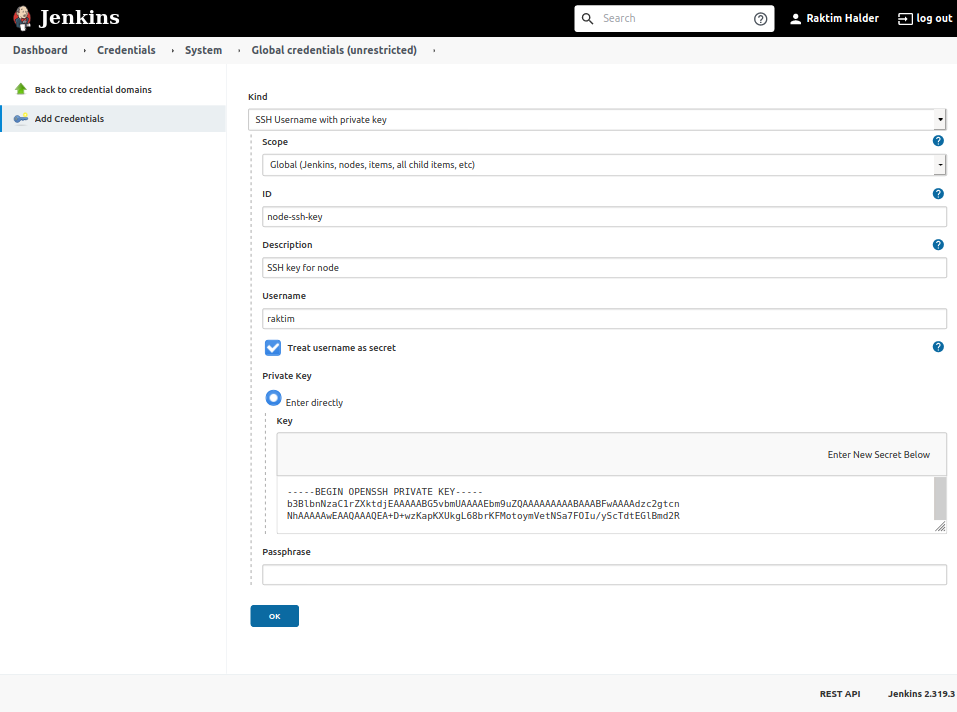

## Add Credentials
---
- click on `Manage Jenkins`
- click on `Manage Credentials`
- click on `Jenkins`
- click on `Global credentials (unrestricted)`
- click on `Add Credentials`

to read private key -
```bash
cat .ssh/id_rsa
```


