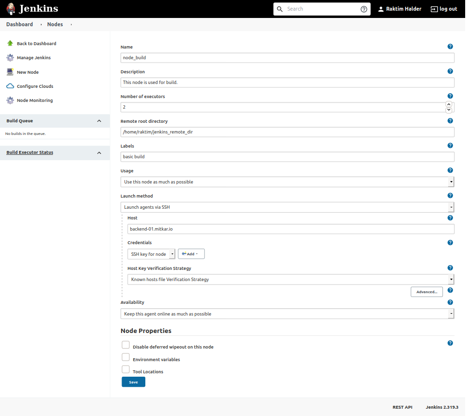

## Add Agent Node
---
- click on `Manage Jenkins`
- click on `Manage Nodes and Clouds`
- click on `New Node`
- set `Node name`



## Known Hosts Issue
---
First `ssh` / `ssh-copy-id` to hosts.
Then execute following command.
```bash
sudo chmod 777 /var/lib/jenkins/.ssh
```

## Permanent Agent
---
```
Adds a plain, permanent agent to Jenkins. This is called "permanent" because Jenkins doesn't provide higher level of integration with these agents, such as dynamic provisioning. Select this type if no other agent types apply - for example such as when you are adding a physical computer, virtual machines managed outside Jenkins, etc.
```
